# Arkitektur

## Oversikt

Ren klientside-app. Ingen server, ingen database, ingen nettverkskall i kjøretid –
alle Excel-filer leses og skrives i nettleseren via `FileReader` og `xlsx` (SheetJS).
Resultatfilen leveres som en `Blob`-URL.

```mermaid
flowchart LR
    U[Arrangør] -->|drar inn .xlsx| A[App.tsx]
    A -->|File + konkurransetype| R[excelReader.ts]
    R -->|Gymnast&#91;&#93; + ugyldige rader| A
    A -->|Gymnast&#91;&#93;| P[groupPlanner.ts]
    P -->|Record&lt;pulje, gruppe&#91;&#93;&gt;| A
    A -->|plan| W[groupWriter.ts]
    W -->|Blob-URL| A
    A -->|nedlastingslenke| U
    A -->|liste over feil| U
```



## Stack

| Del | Valg |
|---|---|
| UI | React 19 + TypeScript |
| Byggverktøy | Vite 7 |
| Styling | Tailwind-klasser (via `@tailwindcss/postcss`) + `App.css` |
| Excel | `xlsx` (SheetJS) |
| Hosting | Vercel (`base: '/'`). Alternativer forberedt i `vite.config.ts`: GitHub Pages og Electron |

## Mappestruktur

```
src/
  main.tsx                    Entrypoint – monterer <App /> i #root
  App.tsx                     All UI og all tilstand (én komponent)
  App.css                     Globale stiler
  components/
    SignatureBadge.tsx        Signatur/logo nede til høyre
  services/                   All forretningslogikk
    excelReader.ts            Excel  -> Gymnast[]  + ugyldige rader
    groupPlanner.ts           Gymnast[] -> puljer og grupper
    groupWriter.ts            puljer og grupper -> Excel-Blob
  types/
    Gymnast.ts                Kjernedatatypen
    seniorDistribution.ts     Domenetabell: gruppestørrelser for NM
  data/                       Kun for utvikling/testing – ikke del av bygget
    excel_maker.py            Python-script som genererer mock-påmeldinger
    turnere*.json             Mockdata
    excel-mockdata-*/         Genererte testfiler
public/
  Pameldingskjema-*-mal.xlsx  Malene brukeren laster ned
  NGTFlogo400.png, NorSte.jpg
```

## Ansvarsfordeling

**`App.tsx`** – all React-tilstand (valgte filer, konkurransetype, lasting,
nedlastings-URL, liste over ugyldige rader) og hele UI-et. Orkestrerer flyten
lese → planlegge → skrive. Inneholder ingen domeneregler.

**`services/excelReader.ts`** – oversetter regneark til domeneobjekter og validerer.
Har to lesere: én for NC-malen og én for NM-malene, fordi kolonneoppsettet er ulikt.
Returnerer `{ valid, invalid }` – aldri kast for enkeltrader, bare samle feil.

**`services/groupPlanner.ts`** – ren funksjon, ingen I/O og ingen React.
`generateGroupPlan(gymnasts, competitionType)` er eneste offentlige inngang.
Kaster `Error` når input er domenemessig umulig (feil antall seedede osv.).

**`services/groupWriter.ts`** – bygger arbeidsboken: ett ark per pulje pluss arket
`Konkurranseplan Mal`, og returnerer en `Blob`-URL.

**`types/seniorDistribution.ts`** – oppslagstabell som representerer NGTFs regelverk.
Behandles som data, ikke som kode.

## Dataflyt i detalj

1. Bruker velger konkurransetype (`NC` / `NMS` / `NMJ`) og legger inn én eller flere filer.
   Filer dedupliseres på `navn + størrelse + lastModified`.
2. `handleUpload()` går gjennom filene sekvensielt og kaller `readGymnastsFromExcel()`.
   Gyldige gymnaster fra alle filer slås sammen til én liste; ugyldige rader samles i en
   annen liste og vises i UI-et.
3. `generateGroupPlan()` fordeler den samlede listen i
   `Record<puljenavn, Gymnast[][]>`.
4. `writeGroupPlanToExcel()` bygger .xlsx-filen og returnerer en Blob-URL som vises som
   nedlastingsknapp.

Feil i steg 3 eller 4 fanges i `handleUpload()` og vises som `alert()`.

## Bevisste designvalg

- **Alt i nettleseren.** Filene inneholder personopplysninger om mindreårige. Ingen
  opplasting = ingen databehandleravtale, ingen lagring, minimal risiko.
- **Én stor `App.tsx`.** Appen har én skjerm og lite tilstand; oppsplitting ville
  gitt mer struktur enn verdi. Splitt hvis den vokser videre.
- **Domeneregler i `services/` og `types/`, ikke i komponenter.** Gjør fordelings-
  logikken testbar og lesbar uten React.
- **Feil stopper ikke importen.** En feil i én rad skal ikke hindre resten – arrangøren
  får en liste å rette opp i stedet for en blokkerende feilmelding.

## Utvidelsespunkter

| Skal du ... | Endre |
|---|---|
| legge til en konkurransetype | `App.tsx` (dropdown + `templateFile`), `excelReader.ts` (leser), `groupPlanner.ts` (planlegger), `groupWriter.ts` (ark), ny mal i `public/` |
| endre gruppestørrelser for NM | `types/seniorDistribution.ts` + `docs/domain.md` |
| endre puljeinndeling for NC | `poolCategories` / `poolGroupLimits` i `groupPlanner.ts` + `docs/domain.md` |
| endre malenes kolonner | malfil i `public/` **og** indeksene i `excelReader.ts` + `docs/excel-formats.md` |
| endre tidsplanen | `groupWriter.ts` |
